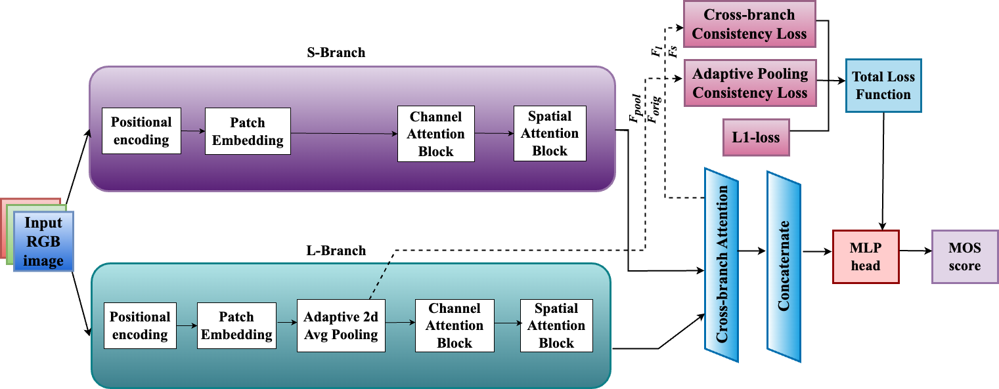

# MS-SCANet: A Cutting-Edge Approach to Blind Image Quality Assessment with Advanced Consistency Loss Strategies

This repository contains the implementation of MS-SCANet, a transformer-based architecture designed for no-reference image quality assessment (IQA). MS-SCANet introduces a multi-branch structure that processes images at multiple scales, capturing both fine and coarse details to improve performance over traditional single-scale methods.



## Files in this Repository

The following scripts are included in this repository:

1. **`train_pre.py`**: Script for pretraining the model.
2. **`train_final.py`**: Script for final training of the MS-SCANet model.
3. **`ms_scanet.py`**: Contains the MS-SCANet model architecture.
4. **`data_loader.py`**: Handles data loading and preprocessing.
5. **`config.py`**: Configuration file for hyperparameters and settings.
6. **`utils.py`**: Utility functions for the project.
7. **`folders.py`**: Manages the folder structures and paths for data storage.

## Installation

To use MS-SCANet, clone this repository and install the required dependencies:

```bash
git clone git@git.txstate.edu:elx12/MS_SCANet.git
cd MS_SCANet
pip install -r requirements.txt
```

## Usage

### Training the Model

To train the MS-SCANet model, use the following command:

```bash
python train_pre.py
```

### Evaluating the Model

You can fine-tune and evaluate the model on benchmark datasets like KonIQ-10k, LIVE, LIVE Challenge, and CSIQ by this command:

```bash
python train_final.py
```

## Results

Extensive evaluations on the above-mentioned datasets show that MS-SCANet consistently surpasses state-of-the-art methods in terms of Pearson’s Linear Correlation Coefficient (PLCC) and Spearman's Rank-Order Correlation Coefficient (SROCC).

- **KonIQ-10k**: PLCC: 0.903, SROCC: 0.909
- **LIVE**: PLCC: 0.968, SROCC: 0.964
- **LIVE Challenge**: PLCC: 0.903, SROCC: 0.895
- **CSIQ**: PLCC: 0.937, SROCC: 0.925


## Acknowledgments

This work was supported by the Department of Computer Science, Texas State University.
